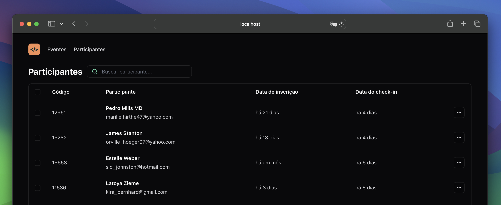
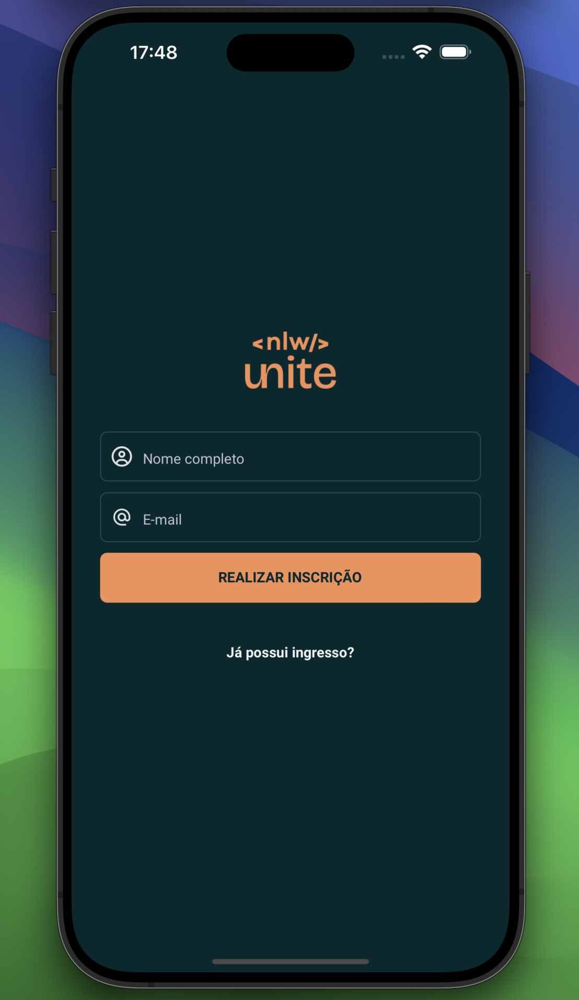
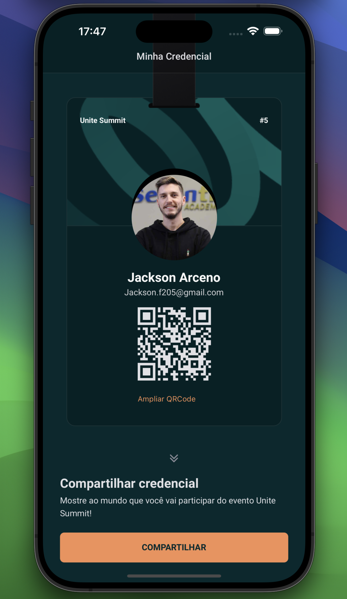
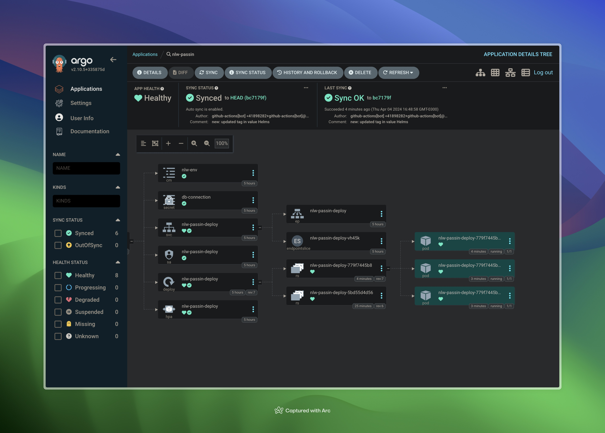

# Pass.In

O pass.in é uma aplicação de **gestão de participantes em eventos presenciais**.

## Frontend web (React)

## Frontend mobile (React Native)

  
  

## Backend NodeJS (Fastify)

Para a documentação da API em Node, acesse o link: <https://passin-node.onrender.com/docs>

## Banco de dados

Nessa aplicação vamos utilizar banco de dados relacional (SQL). Para ambiente de desenvolvimento seguiremos com o SQLite pela facilidade do ambiente.
Para ambiente "DevOps" será utilizado o PostgreSQL rodando localmente via docker-compose ou hospedado na Digital Ocean.

## DevOps

Foi configurado pipelines de CI e CD (para Render) via Github Actions e deploys automáticos para cluster kubernetes via CargoCD

## Requisitos

### Requisitos funcionais

- [x] O organizador deve poder cadastrar um novo evento;
- [x] O organizador deve poder visualizar dados de um evento;
- [x] O organizador deve poser visualizar a lista de participantes;
- [x] O participante deve poder se inscrever em um evento;
- [x] O participante deve poder visualizar seu crachá de inscrição;
- [x] O participante deve poder realizar check-in no evento;

### Regras de negócio

- [x] O participante só pode se inscrever em um evento uma única vez;
- [x] O participante só pode se inscrever em eventos com vagas disponíveis;
- [x] O participante só pode realizar check-in em um evento uma única vez;

### Requisitos não-funcionais

- [x] O check-in no evento será realizado através de um QRCode;
