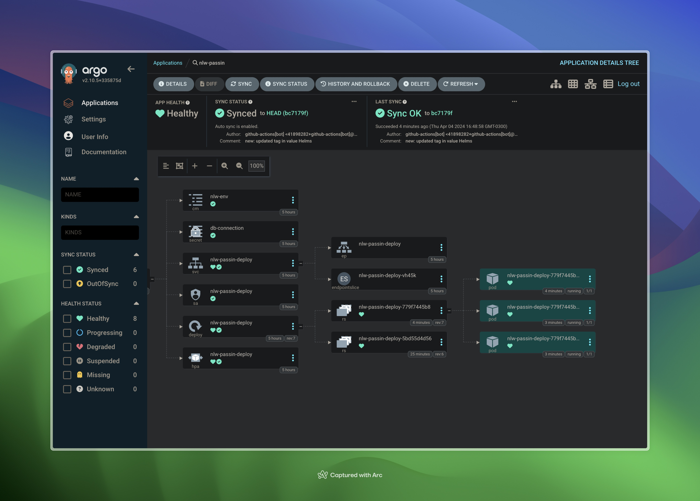

# Configurando um deploy Kubernetes do ZERO



## Etapa 1 - Conteinerizando a aplicação

Para iniciarmos esse processo, precisamos criar uma imagem Docker para conseguir executar nossa aplicação via Containers e para isso precisamos de um arquivo Dockerfile.

Exemplo de Dockerfile: https://github.com/JacksonFA/nlw-unite-monorepo/blob/main/backend/Dockerfile

- Instalação do Docker: https://docs.docker.com/engine/install
- Criar imagem: `docker build -t <tag> <Dockerfile_path>`
- Executar a imagem: `docker run -dt --env <env_variable=value> -p <port:port> --name <container_name> <image_tag>`

## Etapa 2 - Executando a aplicação com suas dependências

Com o Dockerfile pronto e testado, precisamos criar um arquivo docker-compose.yml que vai nos permitir executar um container para nossa aplicação e também demais containers para nossas dependências, como banco de dados, filas, etc...

Exemplo de docker-compose: https://github.com/JacksonFA/nlw-unite-monorepo/blob/main/backend/docker-compose.yml

- Verificando versão do Docker Compose: `docker compose version`
- Subindo os container: `docker compose up -d` ou `docker-compose up -d`

  *Caso o camando `docker compose ...` retorno um erro, é necessário migrar para o Compose v2 ou instalar o docker-compose: https://docs.docker.com/compose/install

## Etapa 3 - Pipeline de CI

Podemos criar um arquivo .yml onde iremos definir um workflow para o que o Github Actions possa construir uma nova imagem Docker da aplicação e enviá-la para um Registry a cada push feito em uma branch por exemplo.

Exemplo do workflow: https://github.com/JacksonFA/nlw-unite-monorepo/blob/main/.github/workflows/node-ci_cd.yml

## Etapa 4 - Iniciando cluster Kubernetes localmente

Para criar um cluster Kubernetes é necessário instalar uma ferramenta que permita o gerencialmento do mesmo localmente, como por exemplo Kind, Mini Kube, k3d, entre outros.
Além disso, também é preciso instalar a CLI do Kubernetes, o kubectl.

- Kind: https://kind.sigs.k8s.io/
- Mini Kube: https://minikube.sigs.k8s.io/docs/
- k3d: https://k3d.io/v5.6.3/
- Kubectl: https://kubernetes.io/docs/reference/kubectl/

*Lens (Interface gráfica para gerenciamento do Kubernetes): https://docs.k8slens.dev/getting-started/install-lens/

### Criando um cluster com o k3d

```zsh
k3d cluster create <name> --servers 2
```

### Comandos do Kubectl

- Listar infos do cluster: `kubectl cluster-info`
- Listar nodes do cluster: `kubectl get nodes`
- Listar namespaces do cluster: `kubectl get ns`
- Criar um namespace: `kubectl create namespace <name>` (Boa prática não utilizar o default)
- Executar manifestos em um namespace: `kubectl apply -f <manifests_path> -n <namespace>`
- Listar deployments de um namespace: `kubectl get deployments -n <namespace>`
- Listar pods de um namespace: `kubectl get pods -n <namespace>` (Dica: Utilizar a ferramenta watch para ver a criação de pods)

## Etapa 5 - Manifesto Kubernetes da aplicação

Agora precisamos criar nossos manifestos Kubernetes para executar a aplicação dentro de um cluster.

Criaremos um arquivo deployment.yaml com as definições da aplicação

Exemplo do deployment: https://github.com/JacksonFA/nlw-unite-monorepo/blob/main/backend/k8s/deployment.yaml

Podemos criar também manifestos auxiliares como o service.yaml para definir os services, além de um arquivo configMap.yaml para variáveis simples e um secret.yaml para variáveis sensíveis que serão utilizadas no manifesto da aplicação 

Exemplo do service: https://github.com/JacksonFA/nlw-unite-monorepo/blob/main/backend/k8s/service.yaml
Exemplo do configMap: https://github.com/JacksonFA/nlw-unite-monorepo/blob/main/backend/k8s/configmap.yaml
Exemplo do secret: https://github.com/JacksonFA/nlw-unite-monorepo/blob/main/backend/k8s/secret.yaml

## Etapa 6 - Utilizando o Helm

O Helm é um gerenciador de pacotes para o Kubernetes, permitindo criar pacotes de nossos manifestos para "automatizar" o kubectl

- Instalar o Helm: https://helm.sh/
- Criar um pacote: `helm create <name>`
- Preencher as variáveis do arquivo values.yaml que serão usadas no chart do Helm
  - Exemplo do arquivo values: https://github.com/JacksonFA/nlw-unite-monorepo/blob/main/backend/helm/values.yaml
- Executar o pacote dentro de um namespace: `helm upgrade --install <chart_name> <helm_manifests_path> -n <namespace>`
- Listar releases de um namespace: `helm list -n <namespace>`

## Etapa 7 - Utilizando o ArgoCD

O ArgoCD é uma ferramenta para criar GitOps Continuous Delivery para o Kubernetes de forma declarativa

- Documentação: https://argoproj.github.io/cd/
- Instalação dentro do cluster Kubernetes:
  - ```zsh
    kubectl create namespace argocd
    kubectl apply -n argocd -f https://raw.githubusercontent.com/argoproj/argo-cd/stable/manifests/install.yaml
    ```
- Listar services instalado no namespace do Argo: `kubectl get svc -n argocd`
- Redirecionamento de porta para acessar a UI do Argo: `kubectl port-forward svc/argocd-server -n argocd 3001:80`
- Para logar na UI, é preciso pegar a senha criada na instalação
  - Basta rodar o comando: `kubectl -n argocd get secret argocd-initial-admin-secret -o jsonpath="{.data.password}" | base64 -d`
  - É possível usar o Lens, acessando o cluster, abrindo a tela Config > Secrets e procurar pela secret "argocd-initial-admin-secret"
- Tendo o ArgoCD instalado dentro de um cluster, basta aplicar manifestos referente ao Argo dentro do seu próprio namespace.
  - Exemplo de manifesto da aplicação: https://github.com/JacksonFA/nlw-unite-monorepo/blob/main/devops/argocd/apps/passin/argo.yaml
  - Exemplo de manifesto para secrets: https://github.com/JacksonFA/nlw-unite-monorepo/blob/main/devops/argocd/apps/passin/repository.yaml
  - Aplicar manifestos ao cluster: `kubectl apply -n argocd -f <argo_app_path>`

## Etapa 8 - Atualizar a pipeline CI

Agora que temos o Helm e o Argo instalados e configurados, podemos atualizar nosso arquivo .yml que contém o workflow (pipeline) de CI, para incluir nele o step que irá disparar a etapa de CD dentro do Argo.

Para isso, basta adicionar as linhas abaixo, que basicamente irá criar um novo commit automatico alterando o arquivo values.yaml do helm, atualizando nele a tag da imagem Docker utilizada

```yml
 - name: Update image tag
      uses: fjogeleit/yaml-update-action@main
      with:
        branch: main
        valueFile: 'backend/helm/values.yaml'
        propertyPath: 'image.tag'
        value: "${{ steps.generate_sha.outputs.sha }}"
        commitChange: true
        message: 'new: updated tag in value Helms'
```

*Verificar "Workflow Permissions" nas configurações do repositório no Github.

## Etapa 9 - Utilizando o Terraform

Embora possamos criar recursos em clouds como AWS, Azure, GCP, Oracle, Digital Ocean, entre outros, diretamente nos consoles de cada provedor, é muito interessante utilizarmos o terraform para fazer a criação desses recursos, como por exemplo banco de dados, clusters kubernetes, instâncias de containers, redes virtuais, etc.

- Instalação da CLI do Terraform: https://developer.hashicorp.com/terraform/install?product_intent=terraform
- Exemplo de criação de banco de dados na Digital Ocean: https://github.com/JacksonFA/nlw-unite-monorepo/tree/main/devops/terraform
- Exemplo de criação do cluster Kubernetes na Oracle: 
- Exemplo de criação do cluster Kubernetes na AWS:

Com os arquivos Terraform criados, é preciso executar os seguintes comandos dentro da pasta/projeto terraform:

- Iniciar estado Terraform e instalar dependências: `terraform init`
- Visualizar plano de execução: `terraform plan`
- Visualizar e aplicar plano de execução para criar os recursos: `terraform apply`
- Destruir os recursos criados: `terraform destroy`

## Etapa 10 - Deploy da aplicação em cluster Kubernetes auto gerenciado:

Após ter um cluster criado dentro de alguma cloud provider, é preciso atualizar o contexto local do kubectl:

- Exemplo de configuração da Oracle: `oci ce cluster create-kubeconfig --cluster-id <cluster_id> --file $HOME/.kube/config --region <region> --token-version 2.0.0  --kube-endpoint PUBLIC_ENDPOINT`
- Exemplo de configuração da AWS: `aws eks --region <region> update-kubeconfig --name <cluster_name>`

Com o contexto do kubectl atualizado, basta executar novamente os comandos da etapa 7 e também criar o namespace que será utilizado pela aplicação para ter a entrega contínua via CargoCD habilitada.

*A repetição da Etapa 7 só é necessária caso a criação da infra via Terraform e configuração do Argo CD não estejam automatizados através de pipelines.
